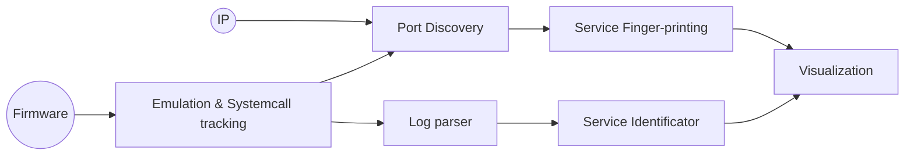

# RePort - An automatic attack surface mapper
**RePort** is an automated attack surface mapping tool designed to identify and analyze port operations within IoT firmware. It leverages firmware emulation engines to trace system calls and generate insightful reports on critical processes, open ports, and known vulnerabilities.

*This project was developed as part of D. Porichis' BSc thesis at the Department of Informatics and Telecommunications, National and Kapodistrian University of Athens.*

## Implementation Graph

## Bibliography

1. **Hui Jun Tay, Kyle Zeng, Jayakrishna Menon Vadayath, Arvind S. Raj, Audrey Dutcher, Tejesh Reddy, Wil Gibbs, Zion Leonahenahe Basque, Fangzhou Dong, Zack Smith, Adam Doupé, Tiffany Bao, Yan Shoshitaishvili, and Ruoyu Wang.** 2023.  
*Greenhouse: Single-Service Rehosting of Linux-Based Firmware Binaries in User-Space Emulation.*  
In 32nd USENIX Security Symposium (USENIX Security 23), Anaheim, CA, 5791–5808. USENIX Association.  
[https://www.usenix.org/conference/usenixsecurity23/presentation/tay](https://www.usenix.org/conference/usenixsecurity23/presentation/tay)

2. **Mingeun Kim, Dongkwan Kim, Eunsoo Kim, Suryeon Kim, Yeongjin Jang, and Yongdae Kim.** 2020.  
*FirmAE: Towards Large-Scale Emulation of IoT Firmware for Dynamic Analysis.*  
In Proceedings of the 36th Annual Computer Security Applications Conference (ACSAC '20).  
Association for Computing Machinery, New York, NY, USA, 733–745.  
[https://doi.org/10.1145/3427228.3427294](https://doi.org/10.1145/3427228.3427294)

3. **Daming D. Chen, Manuel Egele, Maverick Woo, and David Brumley.**  
*Towards Automated Dynamic Analysis for Linux-based Embedded Firmware.*  
Carnegie Mellon University and Boston University.  
[https://github.com/firmadyne/firmadyne/blob/master/paper/paper.pdf](https://github.com/firmadyne/firmadyne/blob/master/paper/paper.pdf)

4. **Shunyu Yao, Dian Yu, Jeffrey Zhao, Izhak Shafran, Thomas L. Griffiths, Yuan Cao, and Karthik Narasimhan.** 2023.  
*Tree of Thoughts: Deliberate Problem Solving with Large Language Models.*   
arXiv.  
[https://arxiv.org/abs/2305.10601](https://arxiv.org/abs/2305.10601)

5. **Amit Sheth, Kaushik Roy, and Manas Gaur.** 2023.  
*Neurosymbolic AI – Why, What, and How.*  
arXiv.  
[https://arxiv.org/abs/2305.00813](https://arxiv.org/abs/2305.00813)

6. **Xingchen Wu, Qin Qiu, Jiaqi Li, and Yang Zhao.** 2023.  
*Intell-dragonfly: A Cybersecurity Attack Surface Generation Engine Based On Artificial Intelligence-generated Content Technology.*  
arXiv.  
[https://arxiv.org/abs/2311.00240](https://arxiv.org/abs/2311.00240)

7. **Zicong Gao, Chao Zhang, Hangtian Liu, Wenhou Sun, Zhizhuo Tang, Liehui Jiang, Jianjun Chen, and Yong Xie** 2024.  
*Faster and Better: Detecting Vulnerabilities in Linux-based IoT Firmware with Optimized Reaching Definition Analysis*  
Network and Distributed System Security (NDSS) Symposium 2024.  
[https://www.ndss-symposium.org/wp-content/uploads/2024-346-paper.pdf](https://www.ndss-symposium.org/wp-content/uploads/2024-346-paper.pdf)

8. **Wil Gibbs, Arvind S. Raj, Jayakrishna Menon Vadayath, Hui Jun Tay, Justin Miller, Akshay Ajayan, Zion Leonahenahe Basque, Audrey Dutcher, Fangzhou Dong, Xavier Maso, Giovanni Vigna, Christopher Kruegel, Adam Doupé, Yan Shoshitaishvili, and Ruoyu Wang.** 2024.
*Operation Mango: Scalable Discovery of Taint-Style Vulnerabilities in Binary Firmware Services.*  
In 33rd USENIX Security Symposium (USENIX Security 24), Philadelphia, PA, 7123–7139. USENIX Association.  
[https://www.usenix.org/conference/usenixsecurity24/presentation/gibbs](https://www.usenix.org/conference/usenixsecurity24/presentation/gibbs)

10. **Ibrahim Nadir, Haroon Mahmood, and Ghalib Asadullah.** 2022.  
*A taxonomy of IoT firmware security and principal firmware analysis techniques.*  
International Journal of Critical Infrastructure Protection, Volume 38, 2022, 100552.  
[https://www.sciencedirect.com/science/article/pii/S1874548222000373](https://www.sciencedirect.com/science/article/pii/S1874548222000373)
  
11. **Yaniv David, Nimrod Partush, and Eran Yahav.** 2018.  
*FirmUp: Precise Static Detection of Common Vulnerabilities in Firmware.*  
In Proceedings of the Twenty-Third International Conference on Architectural Support for Programming Languages and Operating Systems (ASPLOS '18).  
Association for Computing Machinery, New York, NY, USA, 392–404.  
[https://dl.acm.org/doi/abs/10.1145/3296957.3177157](https://dl.acm.org/doi/abs/10.1145/3296957.3177157)

12. **X. Feng, X. Zhu, Q. -L. Han, W. Zhou, S. Wen and Y. Xiang.** 2023. 
*Detecting Vulnerability on IoT Device Firmware: A Survey*  
In IEEE/CAA Journal of Automatica Sinica, vol. 10, no. 1, pp. 25-41, January 2023  
[https://ieeexplore.ieee.org/abstract/document/9878283](https://ieeexplore.ieee.org/abstract/document/9878283)

13. **Ang Cui, Michael Costello and Salvatore J. Stolfo.** 2013.  
*When Firmware Modifications Attack: A Case Study of Embedded Exploitation*  
Network and Distributed System Security (NDSS) Symposium 2013.  
[http://ids.cs.columbia.edu/sites/default/files/ndss-2013.pdf](http://ids.cs.columbia.edu/sites/default/files/ndss-2013.pdf)
