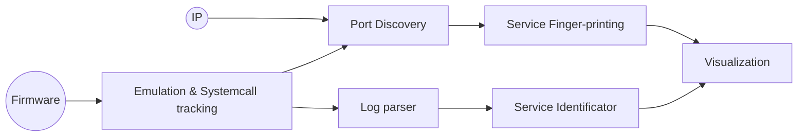

# RePort - Automatically Mapping the Attack Surface of IoT Systems

**RePort** is an automated attack surface mapping tool designed to identify and analyze network exposure within IoT firmware through dynamic analysis. By leveraging firmware emulation engines and system call tracing, RePort automatically maps open ports, identifies critical binaries, and cross-references known vulnerabilities to provide actionable security insights.

*This project was developed as part of [D. Porichis' BSc thesis](https://pergamos.lib.uoa.gr/item/uoadl:5298750) at the Department of Informatics and Telecommunications, National and Kapodistrian University of Athens, under the supervision of [Professor Thanassis Avgerinos](https://cgi.di.uoa.gr/~thanassis/).*

## Key Features

- **Automated Attack Surface Mapping**: Systematically identifies all network entry points in IoT firmware
- **Dynamic Analysis**: Uses actual firmware emulation rather than static analysis for stateful, verifiable results  
- **Vulnerability Discovery**: Cross-references identified binaries against CVE databases (403+ CVEs discovered in evaluation)
- **Port-to-Binary Attribution**: Traces open ports back to their responsible executables through system call analysis
- **Dual Analysis Modes**: Supports both graybox (firmware-based) and blackbox (network-based) analysis
- **Modular Architecture**: Extensible design supporting multiple emulation and scanning engines
- **External Verification**: Results can be independently verified using tools like nmap

## Implementation Graph


## Quick Start Guide

> **WARNING**: RePort is a research tool requiring elevated permissions. Run only on isolated virtual machines for security.

### Prerequisites
- Linux environment (tested on Ubuntu 24.04)
- Python 3.12+

### Installation

```bash
# Clone the repository
git clone https://github.com/DPorichis/RePort
cd RePort

# Set up Python environment
python -m venv env
source env/bin/activate
pip install -r requirements.txt

# Install RePort modules and dependencies
cd ./src
sudo -E python -m RePort.report -install
```

### Basic Usage

**Graybox Analysis** (Firmware-based):
```bash
cd ./src
sudo -E python -m RePort.report -gray -firmware /path/to/firmware.zip
```

**Blackbox Analysis** (Network-based):
```bash
cd ./src  
sudo -E python -m RePort.report -black -ip 192.168.1.1
```

### Sample Output Structure
```
reports/firmware_name-timestamp/
├── RePort.html             # Interactive HTML report
├── fs/                     # Extracted filesystem  
├── systemcall.log          # Raw syscall traces
├── grype_results.json      # CVE findings
└── nmap_scan.xml           # Port confirmation results
```


## Evaluation

Our evaluation across 10 firmware images from major vendors (D-Link, Netgear, ASUS, TP-Link, TRENDnet, Belkin) successfully identified:
- **95+ open ports** across 133 instances
- **63 critical binaries** with external network access
- **403 CVE appearances** in vulnerable components
- **Average analysis time**: ~10 minutes per firmware

All evaluation executions were conducted using Github Actions and are stored as artifacts under this repository.

## Technical Innovation

### Custom System Call Tracking
RePort utilizes a custom fork of FirmAE with enhanced system call monitoring capabilities:
- **Extended syscall coverage**: Tracks `socket()`, `bind()`, `close()`, `fork()`, `exec()` with return codes
- **IPv6 support**: Full protocol family coverage beyond original FirmAE
- **Port inheritance tracking**: Handles complex process forking and file descriptor inheritance
- **Improved accuracy**: Captures actual port assignments for dynamic bindings

Implementations available for these functionalities under:
- [George-RG/FirmaInc](https://github.com/George-RG/FirmaInc) - Enhanced FirmAE fork
- [RePort-FEMU/kernel-v2.6](https://github.com/RePort-FEMU/kernel-v2.6) - Custom v2.6 Kernel
- [RePort-FEMU/kernel-v4.1](https://github.com/RePort-FEMU/kernel-v4.1) - Custom v4.1 Kernel

### Port Activity Analysis
The core `PortActivity` class provides stateful tracking of:
- Process-to-port relationships over time
- Protocol family identification (TCP/UDP, IPv4/IPv6)
- Binary attribution through exec call correlation  
- Port lifecycle management (open/close/inherit patterns)


## Analysis Modes

RePort offers two analysis modes, depending on whether you have access to a firmware copy or only a running system.

### Graybox Analysis
**Input**: Firmware image (ZIP/binary)
**Process**: 
1. Firmware emulation with syscall tracking
2. Port-to-binary attribution 
3. CVE database lookup
4. Optional port confirmation via network scanning

**Output**: Comprehensive attack surface map with:
- Timeline of port operations
- Binary "nutrition labels" with metadata
- CVE findings with severity ratings
- Confirmed and potential exposures

### Blackbox Analysis  
**Input**: Target IP address
**Process**:
1. Network port scanning
2. Service fingerprinting
3. Version detection

**Output**: External view of exposed services

## Command-Line Options

`RePort` provides several command-line flags to control scanning behavior, engine selection, and utility management. Below is a breakdown of all available options.

### Scan Type
- `-black` : Run a **Blackbox scan**  
- `-gray`  : Run a **Graybox scan**  

> **Note:** `-black` and `-gray` are mutually exclusive. Only one can be used at a time.

### Input Source
- `-ip <IP>` : Specify a **target IP address** to scan  
- `-firmware <PATH>` : Specify the **path to a firmware** file to scan  

> **Note:** These options are mutually exclusive; provide only one input source per scan.

### Utility & Installation
- `-install` : Installs all dependencies required for RePort and its scanning engines  
- `-network-fix` : Resets network configurations that may have been left hanging from previous scans  

### Engine Management
- `-engine <ENGINE>` : Selects which engine to use for scanning  
- `-engine-mode <MODE>` : Specifies the mode in which the selected engine should run  
- `-engine-help <ENGINE>` : Prints help information for the specified engine  
- `-le` : Lists all engines available for the chosen scan type  
- `-cleanup` : Removes all logs created by the specified engine, resetting its functionality  

### Evaluation
- `-eval` : Activates **evaluation mode**, generating a simple CSV with benchmarks suitable for GitHub Action collection  


## Default Tools in This Release
- **Emulation Engine**: [FirmInc](https://github.com/George-RG/FirmaInc) (Our custom FirmAE fork)
- **Network Verification**: [Nmap](https://nmap.org/)
- **CVE Lookup Engine**: [Grype](https://github.com/anchore/grype) 

## Extensibility

### Adding Custom Emulation Engines
Implement the `EmulationEngine` interface:
```python
class CustomEngine(EmulationEngine):
    def install(self): pass
    def name(self): pass       # Print the name of the Engine
    def check(self): pass      # Extract syscall logs  
    def analysis(self): pass   # Parse logs with PortActivity
    def emulate(self): pass    # Start interactive session
    def terminate(self): pass  # Clean shutdown
```

### Adding Custom Network Verification Tools
Implement the `MappingEngine` interface:
```python
class CustomScanner(MappingEngine):
    def install(self): pass
    def name(self): pass                  # Print the name of the Engine
    def scan(self, ip, options): pass     # Perform Scan over the given IP
    def parser(self, scan_result): pass   # Parse the results and convert them to BlackBoxScan instance
```

## Citation

If you use RePort in your research, please cite:

```bibtex
@misc{uoadl:5298750,
    BIBTEX_ENTRY = "misc",
    year = "2025",
    school = "School of Science, Department of Informatics and Telecommunications, National and Kapodistrian University of Athens",
    author = "PORICHIS DIMITRIOS-STEFANOS",
    title = "RePort: Automatically Mapping the Attack Surface of IoT Systems"
}
```


## Current Limitations
- UDP port confirmation not yet implemented
- CVE detection may have false negatives  
- Architecture support is limited by the emulation engine capabilities
- Non-deterministic emulation may require manual intervention

---

For detailed technical documentation, please refer to the [complete thesis document](https://pergamos.lib.uoa.gr/item/uoadl:5298750).
